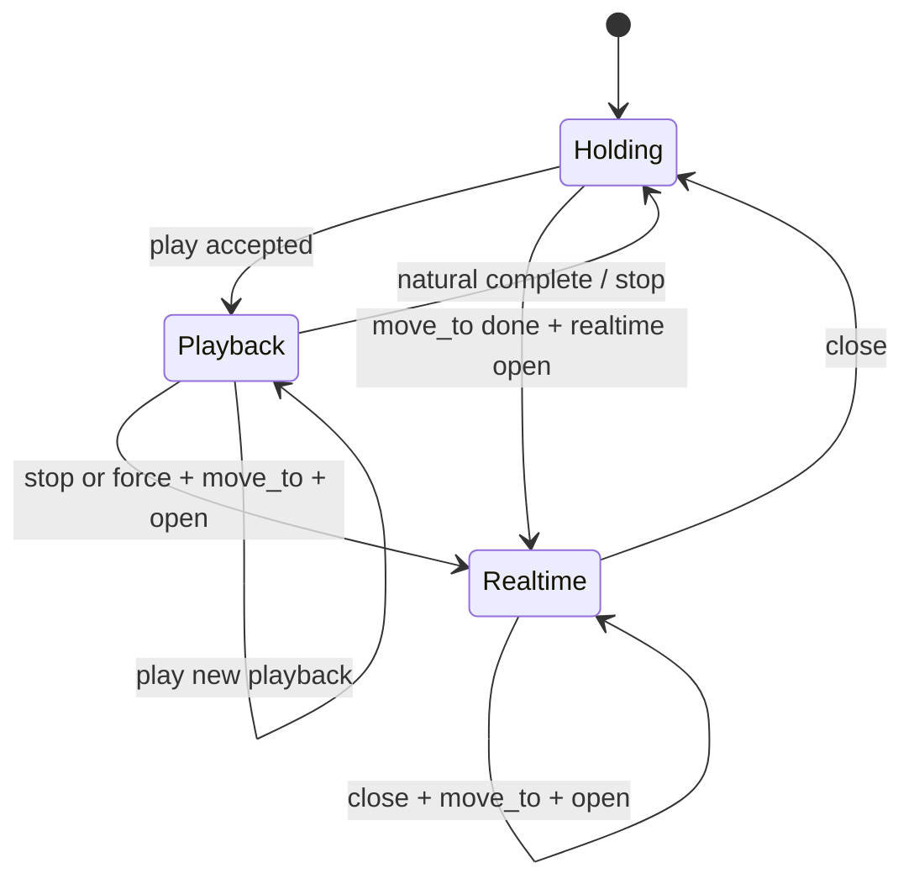

# Astribot Robot Bridge — 客户端会话协议推荐

面向**客户端 / 上位机**开发者。本文不讲底层 SDK，只讲如何按 Bridge 当前协议安全地编排 `playback`、`move_to`、`realtime`，避免迟到的 `idle` / `close` / `move_to` / WS frame 污染新会话。

配套文档：

- API 字段与端点定义见 [API_REFERENCE.md](API_REFERENCE.md)
- curl / 联调示例见 [CLIENT_TEST_GUIDE.md](CLIENT_TEST_GUIDE.md)

---

## 1. 目标

客户端需要做到的不是“把请求发出去”，而是：

1. 始终知道**当前控制会话是谁**
2. 只让当前会话产生的请求继续生效
3. 当新 tag 到来时，旧会话的迟到请求必须自动失效

Bridge 已经提供两类 fencing：

- `session_id`：操作现有会话
- `expected_current_session_id`：在启动新动作前，校验当前上下文是否仍然是自己以为的那一轮

客户端的职责就是正确地填这两个字段。

---

## 2. 客户端本地状态

推荐最小本地状态：

```text
current_session_id
current_mode
current_request_id
current_tag
```

字段含义：

| 字段 | 含义 |
|---|---|
| `current_session_id` | 当前 Bridge 已接受的 `playback` 或 `realtime` 会话 |
| `current_mode` | `holding` \| `playback` \| `realtime` |
| `current_request_id` | 当前编排轮次 id，用于日志 |
| `current_tag` | 当前上层业务 tag，可选，仅本地调试用 |

推荐补充：

```text
last_terminal_session_id
```

它只用于客户端日志和调试，不参与真机最终判定。最终是否 stale，由 Bridge 决定。

---

## 3. 两类字段怎么用

### 3.1 `session_id`

用于操作一个已经存在的会话：

- `POST /v1/actions/stop`
- `POST /v1/motion/realtime/close`
- `POST /v1/motion/realtime/command`
- `WS /v1/ws/realtime` `command`

规则：

```text
我要停止/关闭/发帧给谁，就带谁的 session_id
```

### 3.2 `expected_current_session_id`

用于启动一个新动作前做条件检查：

- `POST /v1/actions/play`，尤其是 `play(idle)`
- `POST /v1/motion/move_to/joints`
- `POST /v1/motion/realtime/session`

规则：

```text
如果这一步是“接着上一轮上下文往下做”，就带 expected_current_session_id
```

例如：

- `wave end -> play(idle)`：`expected_current_session_id = wave_session`
- `idle -> move_to(first_frame) -> open_realtime`：`expected_current_session_id = idle_session`
- `close(speak_A) -> move_to(first_frame_B) -> open_realtime(B)`：`expected_current_session_id = speak_A_session`

---

## 4. 推荐状态机



本地决策规则：

1. 新 `tag_start` 到来时，先判断它是 `playback` 还是 `realtime`
2. `playback` 和 `realtime` 之间切换时，先清场旧会话，再发新会话的首个请求
3. 对旧会话的迟到 ack / end / close / frame，一律按 `session_id` 本地忽略

---

## 5. 标准编排 Recipe

## 5.1 普通 playback tag

例如 `wave`、`hello`

```text
tag_start(wave)
  -> POST /v1/actions/play { action_id=wave, request_id }
  <- session_id = playback:N

tag_end(wave)
  -> optional POST /v1/actions/play {
       action_id=idle,
       request_id,
       expected_current_session_id=playback:N,
       supersedes_session_id=playback:N
     }
```

规则：

- 普通 playback 开始通常只要一次 `play`
- `playback` 的首帧对齐由 Bridge 内部完成
- `idle` 不是隐式系统状态，而是一个普通动作；是否播放由客户端决定

## 5.2 playback -> realtime

例如 `wave end -> speak start`

```text
if current_mode == playback:
  POST /v1/actions/stop { session_id=current_session_id }

POST /v1/motion/move_to/joints {
  targets=first_frame,
  wait=true,
  request_id,
  expected_current_session_id=old_playback_session
}

POST /v1/motion/realtime/session {
  request_id,
  expected_current_session_id=old_playback_session,
  prefer_latest=true
}
<- session_id = realtime:M

WS command frames:
  { cmd="command", session_id=realtime:M, seq, q/targets }
```

规则：

- `move_to(first_frame)` 必须在 `open realtime` 前完成
- 如果 `idle` 很快就会被打断，优先直接进 `realtime`，不要先 `play(idle)` 再 `stop`

## 5.3 realtime -> realtime

例如 `speak_A end -> speak_B start`

```text
POST /v1/motion/realtime/close { session_id=realtime:A }

POST /v1/motion/move_to/joints {
  targets=first_frame_B,
  wait=true,
  request_id,
  expected_current_session_id=realtime:A
}

POST /v1/motion/realtime/session {
  request_id,
  expected_current_session_id=realtime:A,
  prefer_latest=true
}
<- session_id = realtime:B
```

规则：

- 连续 `realtime` 推荐走 `close -> move_to -> open`
- 不要无条件插入 `idle`

---

## 6. 三个关键场景

## 6.1 `wave start -> wave end -> wave start`

```text
wave_A start -> play -> playback:101
wave_A end   -> play(idle, expected=playback:101)
wave_B start -> play(wave) -> playback:102

迟到 idle 到达：
  expected=playback:101
  active=playback:102
  => stale_session, no-op
```

## 6.2 `wave start -> wave end -> speak start`

```text
wave start -> playback:201
wave end   -> play(idle, expected=playback:201)  # 可能已经发了
speak start:
  stop(playback:201)
  move_to(first_frame, expected=playback:201)
  open_realtime(expected=playback:201)
  -> realtime:301

迟到 idle:
  expected=playback:201
  active=realtime:301
  => stale_session, no-op
```

## 6.3 `speak_A start -> speak_A end -> speak_B start`

```text
speak_A start -> realtime:401
speak_A end   -> close(realtime:401)
speak_B start:
  move_to(first_frame_B, expected=realtime:401)
  open_realtime(expected=realtime:401)
  -> realtime:402

迟到 close(realtime:401):
  session_id=401
  active=402
  => stale_session, no-op

迟到 WS frame(session_id=401):
  => stale_session, no-op
```

---

## 7. 客户端必须遵守的规则

1. 每个编排轮次生成唯一 `request_id`
2. 只对 `current_session_id` 发 `stop` / `close` / realtime frame
3. 只在“我要接着上一轮上下文继续做”时传 `expected_current_session_id`
4. 收到 `stale_session` 不要重试抢占，直接丢弃这条旧请求
5. 收到旧会话的迟到事件，本地也要忽略

本地忽略规则：

```text
if response.session_id exists and response.session_id != current_session_id:
    ignore

if callback.belongs_to_old_session:
    ignore
```

---

## 8. 推荐封装接口

客户端建议不要在业务层直接调用 `play / stop / move_to / realtime`，而是收敛成一个小封装：

```python
class BridgeSessionController:
    def start_playback_tag(tag_name): ...
    def end_playback_tag(tag_name): ...
    def start_realtime_tag(tag_name, first_frame): ...
    def end_realtime_tag(tag_name): ...
    def interrupt_with_new_tag(tag_name, kind, first_frame=None): ...
```

业务层只发：

```text
tag_start(name)
tag_end(name)
```

Bridge 调用序列由这层统一编排。

---

## 9. 参考伪代码

```python
def start_realtime_tag(tag_name, first_frame):
    old_session = state.current_session_id
    old_mode = state.current_mode
    request_id = new_request_id()

    if old_mode == "realtime" and old_session:
        bridge.close_realtime(session_id=old_session, request_id=request_id)
    elif old_mode == "playback" and old_session:
        bridge.stop_action(session_id=old_session, request_id=request_id)

    bridge.move_to_joints(
        targets=first_frame,
        wait=True,
        request_id=request_id,
        expected_current_session_id=old_session,
    )

    opened = bridge.open_realtime(
        request_id=request_id,
        expected_current_session_id=old_session,
        prefer_latest=True,
    )

    state.current_session_id = opened["session_id"]
    state.current_mode = "realtime"
```

```python
def on_ws_realtime_frame(frame):
    if state.current_mode != "realtime":
        return
    bridge.ws_send({
        "cmd": "command",
        "session_id": state.current_session_id,
        "seq": frame.seq,
        "q": frame.q,
    })
```

---

## 10. 推荐改造顺序

1. 客户端先落本地 `current_session_id/current_mode`
2. 所有 `stop/close/WS frame` 带 `session_id`
3. 所有 `play(idle)/move_to/open_realtime` 带 `expected_current_session_id`
4. 统一处理 `stale_session`
5. 再把业务层 `tag_start/tag_end` 接到这层封装

这样改完后，客户端和 Bridge 的责任边界会很清晰：

- 业务层只表达 tag 意图
- 客户端负责请求编排
- Bridge 负责执行和 stale fencing
